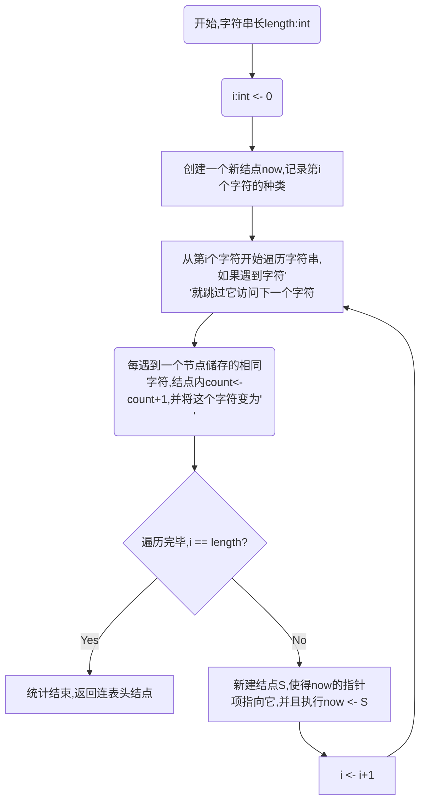

# 第八周（第五章）作业
↑ ：指针的指向运算符
:=  :  赋值运算符
=   ： 关系运算符-相等
**在这次作业中默认一个长度为n的字符串内各个字符的<font color = red>下标编号是从1到n</font>**
### 第一题
### 第二题
### 第三题
****
认为以下两道道题里的字符串是用向量的形式来存储的，那么：
```pascal
TYPE String:Array[1..n] OF char
VAR S:String
```
### 第四题 - 统计不同字符个数
可以用一个链表来实现，每个结点记录字符的种类以及出现的次数，链表结点的表示如下:
```pascal
TYPE pointer = ↑Node
     Node = RECORD
             letter:char //记录字符种类
             count:int   //记录在串中出现的次数
             next:pointer
           END
     linkedlist = pointer
```

大概可以分为以下几步：
1. 新建结点，将字符串中第一个字符记赋值给letter
2. 遍历字符串，遇到与letter相同的字符的话结点中count加一，并将字符串中的这个字符变为'\n'
3. 便利完成后回到第一步，直到整个字符串中的字符都编程'\n'，而如果遇到字符'\n'的话就直接跳过
  
- 流程图：

需要用到几个过程：
1. 获取字符串中给定位置（下标）的字符
```pascal
FUNC charAt(s:Stirng;i:int):char
BEGIN
    return s[i]
END
```
2. 改变某字符
```pascal
PROC setCharAt(s:String ; i:int ; c:char)
BEGIN
    s[i] := c
END
```
这里用一个带表头结点的链表来完成，这样能够在表头结点储存不同字符共有几种
  
```pascal
VAR i,j:int           //访问字符元素时使用的下标
VAR head,now:linklist  //链表的结点指针
FUNC Stats(s:String):linkedlist
BEGIN
    NEW(head);head↑.count := 0 //head指针中的count项用来记录字符种类数
    now := head
    now↑.next := Nil
    i := 1  //从第一个字符开始统计
    for i = 1 to i = n do:
        [if(s[i] = '\n')then continue
         New(now↑.next)
         now := now↑.next
         now↑.letter := s[i] //将当前位置的字符记录进结点
         now↑.nount := 0
         now↑.next = Nil
         for j=i to j=n do:
             [if(s[i] = '\n')then continue //如果判断得知这个字符已经与之前的字符重复了就跳过
              if(s[i] = now↑.letter)then
                  [now↑.count := now↑.count+1
                  s[i] := '\n']
             head↑.count := head.count+1 //每记录完一种字符，种类数+1
             ]
        ]
    return head //返回链表的头结点
END
```
### 第五题-递归逆转字符
认为字符逆转
```pascal
FUNC reverse(s:String):Stirng
```
是一个返回逆转后的字符串的一个函数过程，那么这个过程的定义分为以下两部
1. 基线条件：如果字符串`s`长度为1（只有一个字符），直接返回这个字符串
2. 递归条件：如果字符串`s`的长度为n（n>1），那么取它的前n-1个字符作为子串`sub := substring(s,1,n-1)`，s的最后一个字符为`s[n]`,返回拼接的字符`s[n]+reverse(s)`就是字符串s的逆

需要用到连接两个字符串的函数过程(假设两个字符串长度已知，str1长x,str2长y)
`concatenate(str1:String ; str2:String)`
```pascal
FUNC concatenate(str1:String ; str2:String):String
BEGIN
    VAR str3:String
    VAR i:int
    for i=1 to i=x do
        [str3[i] := str1[i]]
    for i=1 to i=y do
        [str3[x+i] := str2[i]]
    return str3
END
```
取子串的过程：
```pascal
FUNC subString(s:String ; a:int ; b:int):String
BEGIN
    VAR sub:String
    VAR i:int
    for i=a to i=b do
        sub[i] := s[i]
    return sub
END
```
`reverse()`表示如下：
```pascal
FUNC reverse(s:String):String
BEGIN
    if n=1 then [resturn s]
    else
        [return concatenate(sub(s;n-1;n),reverse(sub(s;1;n-1)))]
END
```
